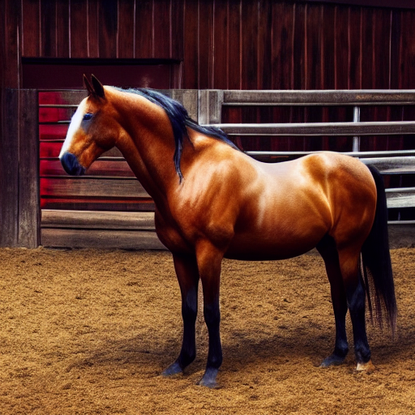
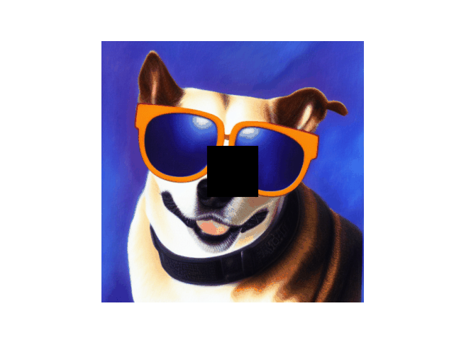

# Stable Diffusion — from-scratch PyTorch implementation

This repository contains a from-first-principles implementation of a Stable Diffusion style pipeline in PyTorch. It includes model components, diffusion samplers, helper utilities and two example notebooks demonstrating text-to-image generation and inpainting.

This code is for learning purposes and demonstrates core components (encoder/decoder, UNet/diffusion, CLIP-like text encoder integration, sampling) implemented without relying on high-level diffusion frameworks.

## Repository highlights

- `diffusion.py`, `ddpm.py`, `pipeline.py`, `encoder.py`, `decoder.py` — core model and diffusion code
- `model_loader.py`, `model_converter.py` — helpers to load weights saved in the standard Stable Diffusion checkpoint format
- `diffusion_demo.ipynb` — a demo notebook showing text-to-image and image-to-image generation
- `inpainting.ipynb` — a demo notebook that shows how to produce a mask and perform inpainting using the same diffusion pipeline
- `add_noise.ipynb`, `attention.py`, `clip.py`, etc. — supporting files and experiments

## Quick start

Prerequisites
- Python 3.8+ (development done on Linux)
- PyTorch (matching your CUDA or CPU setup)
- torchvision, transformers, pillow, numpy, matplotlib, tqdm

A minimal install via pip (recommended inside a virtualenv):

```bash
# example (adjust python/pip to your environment)
python -m pip install torch torchvision transformers pillow numpy matplotlib tqdm
```

Setup data and weights
- This project expects tokenizer files and model checkpoint(s) in the `../data` directory relative to the notebooks. Example paths used by the notebooks:
  - `../data/vocab.json`
  - `../data/merges.txt`
  - `../data/v1-5-pruned-emaonly.ckpt`

Important: This repository does NOT include the model weights. You must download the checkpoint(s) yourself and place them at the paths above. Verify the license and terms of the model weights you use (see "Model weights & attribution" below).

Notebook quick-run (Jupyter)
1. Start Jupyter in the `git_version` folder or open the notebooks from your editor.
2. Open `diffusion_demo.ipynb` or `inpainting.ipynb`.
3. Update device settings near the top of the notebook if needed (the notebooks detect CUDA/MPS but have flags `ALLOW_CUDA`, `ALLOW_MPS`).
4. Ensure the tokenizer and model checkpoint paths point to your downloaded assets (default paths in the notebooks: `../data/vocab.json` and `../data/v1-5-pruned-emaonly.ckpt`).
5. Run the cells to preload models and call the example generation functions. Example usage from the notebook:

```py
# inside the notebook
models = model_loader.preload_models_from_standard_weights(model_file, DEVICE)
output_image = pipeline.generate(
    prompt="Generate an image of a horse in a stable.",
    uncond_prompt="",
    input_image=None,
    strength=0.8,
    do_cfg=True,
    cfg_scale=8,
    sampler_name="ddpm",
    n_inference_steps=50,
    seed=12,
    models=models,
    device=DEVICE,
    idle_device="cpu",
    tokenizer=tokenizer,
)
Image.fromarray(output_image)
```


## Inpainting
- Inpainting demo (notebook + demo GIF): see `inpainting.ipynb` and the sampling-steps visualization `diffusion_steps.gif` included in this folder — the GIF shows intermediate sampling steps during inpainting and can be used as a visual reference for the sampler behavior.
<!--  -->
  
  

  *Figure: inapinting missing part of the images using stable diffusion (see `inpainting.ipynb`).*

For inpainting, the notebook provides an `inpaint(...)` function which accepts `prompt`, `input_image`, `mask_image`, and sampling options.

## Project structure (files of interest)
- `diffusion.py` — diffusion model architecture used in sampling
- `ddpm.py` — DDPM sampler / utilities
- `pipeline.py` — high-level generate() wrapper used by the notebooks
- `model_loader.py` — helper to load the standard Stable Diffusion checkpoint into the above modules
- `diffusion_demo.ipynb`, `inpainting.ipynb` — runnable examples


## Safety & legal notes
- This code generates images using models trained on third-party datasets. Make sure you follow best practices and the license/usage restrictions for models and datasets you use.
- Avoid generating images that violate any policy or local law.
 
## References

Relevant implementations, model cards and the original Latent Diffusion paper:

- pytorch-stable-diffusion (implementation reference): https://github.com/hkproj/pytorch-stable-diffusion/tree/main
- Hugging Face model card (Stable Diffusion v1.5): https://huggingface.co/stable-diffusion-v1-5
- Rombach, R., Blattmann, A., Lorenz, D., Esser, P., & Ommer, B. (2022). High-resolution image synthesis with latent diffusion models. In Proceedings of the IEEE/CVF conference on computer vision and pattern recognition (pp. 10684-10695).# StableDiffusion
